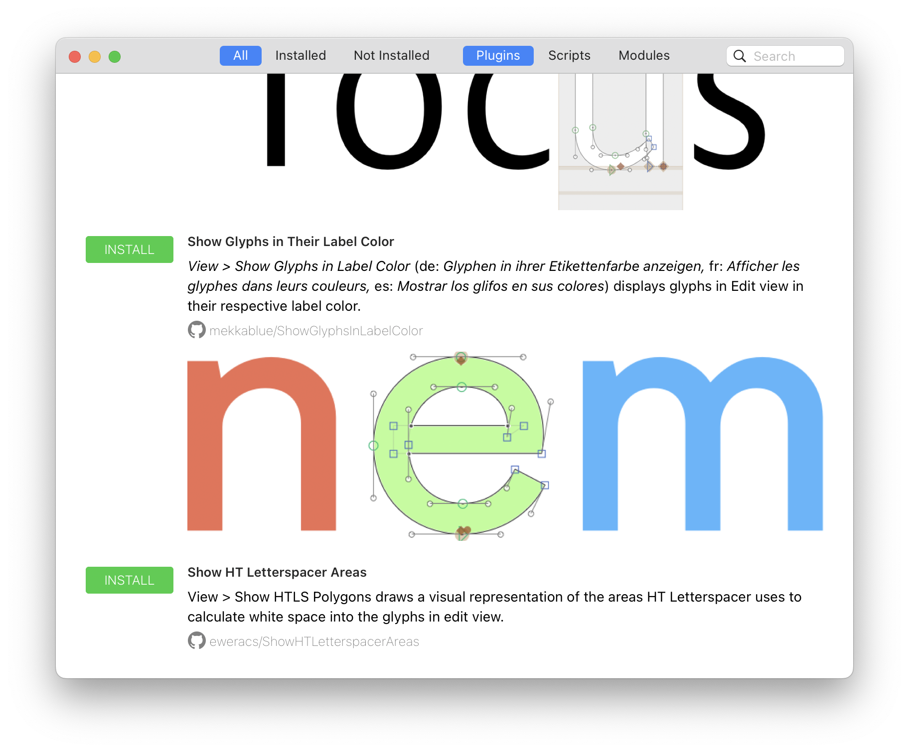

# Glyphs Packages

Welcome to the Glyphs package repository!
This repository contains the index of plug-ins and scrips for the Plugin Manager.
In Glyphs, open the Plugin Manager with *View > Plugin Manager*.



See the Glyphs Handbook for details on the [Plugin Manager](https://handbook.glyphsapp.com/plugin-manager/) and learn more extensions in the [“Extending Glyphs” tutorial](https://glyphsapp.com/learn/extending-glyphs) ([Español](https://glyphsapp.com/es/learn/extending-glyphs), [Français](https://glyphsapp.com/fr/learn/extending-glyphs), [中文](https://glyphsapp.com/zh/learn/extending-glyphs)).

If you have a plug-in or collection of scripts you want to share with the community, consider adding it to the `packages.plist` file in this repository and submitting a pull request.
Feel free to ask on the [Glyphs Forum](https://forum.glyphsapp.com) if you have any questions.

## Adding Plug-ins and Scripts Collections

The index of plug-ins and scripts is stored in the `packages.plist` file.
Add new plug-ins at the end of the `plugins = ( ... )` list and new scripts collections at the end of the `scripts = ( ... )` list.
The entry is a “dictionary”, a list of key-value pairs.
The required and optional keys are described below in detail.
Place a comma (`,`) after your entry.
Here is an example:

```
{
	titles = {
		en = "Some Plug-in";
	};
	url = "https://github.com/example/some-plugin";
	path = "SomePlugin.glyphsPlugin";
	descriptions = {
		en = "Some short description."
	};
},
```

### `url` (string, required)

The URL points to the Git repository of your package.
For a repository on GitHub, this URL looks like this: `"https://github.com/YOUR_USER_NAME/YOUR_REPOSITORY_NAME"`, for example: `"https://github.com/example/some-plugin"` (with no slash `/` at the end).

### `titles` (dictionary of strings, required)

The title of your extension.
This is a dictionary where the keys are locale identifiers from the list below, and the values are the title in that language.
For example:

```
titles = {
	de = "Beispiel";
	en = "Example";
};
```

The following locale identifiers are supported:

- `ar`: Arabic
- `cs`: Czech
- `de`: German
- `en`: English
- `es`: Spanish
- `fr`: French
- `it`: Italian
- `ja`: Japanese
- `ko`: Korean
- `pt`: Portuguese
- `ru`: Russian
- `tr`: Turkish
- `zh-Hans`: Chinese (simplified)
- `zh-Hant`: Chinese (traditional)

### `descriptions` (dictionary of strings, required)

The description can be written in multiple languages, just like the `title`.
Briefly describe what your extension does and how it can be accessed.
For example, for a reporter plug-in, write a description like:

```
descriptions = {
	en = "*View > Some Reporter* draws something useful.";
};
```

You can use basic Markdown formatting in the description:

- `*italic*` (for text that appears in the user interface)
- `**bold**`
- `` `code` ``
- `[link text](https://example.com)`

Write the description for a language on a single line.
Insert a line break by writing `\n` or an empty separator line with `\n\n`.

### `path` (string, only required for plug-ins)

The path points to the plug-in bundle in your repository.
The bundle is the file with a name like `*.glyphPlugin`, `*.glyphReporter`, …

```
path = "SomePlugin.glyphsPlugin";
```

If the bundle is in a folder, include the full path with slashes:

```
path = "Plugin/SomePlugin.glyphsPlugin";
```

### `installName` (string, only required for scripts)

The name of the scripts collection in the *Script* menu in Glyphs.
This is also the name of the folder in which the scripts collection will be installed in Glyphs “Scripts” folder, which you can view by choosing *Script > Open Scripts Folder*.

Make sure no other scripts collection is using the same `installName`.
Typically, this is done by using your name or the name of our company:

```
installName = "Some Name";
```

### `screenshot` (string, optional)

An URL to a image illustrating the use case of the extension.

### `branch` (string, optional)

The name of the branch in your Git repository.
If unset, the default branch is used.

### `donationURL` (string, optional)

A URL to a micropayment site.
The Plugin Manager will present a donation link next to your package entry.

### `minVersion` & `maxVersion` (string, optional)

The minimum and maximum version of Glyphs with which your extension is compatible.
You can set one of the two, both, or none.
The value is the build number of Glyphs which is written in parentheses in *Glyphs > About Glyphs*, for example, `"3306"`.
Users running a version of Glyphs that does not match these min/max values will not see the extension in the Plugin Manager.

### `minGlyphsVersion` & `maxGlyphsVersion` (string, optional)

The same as `minVersion` and `maxVersion`, but using the major.minor.patch notation.
For example: `"3.2.1"`.

### `minSystemVersion` & `maxSystemVersion` (string, optional)

The same as `minGlyphsVersion` and `maxGlyphsVersion`, but for the version of macOS.
For example: `"12.0"`.

### `dependencies` (list of strings, optional)

The `identifier` values for the modules that an extension depends on are listed in the `dependencies`.
For example, `dependencies = (vanilla, fontTools);`.
See the end of the `packages.plist` for a list of available modules.

If you have a dependency for which there is currently no module, open a new issue on this repository or contact us on the [Glyphs Forum](https://forum.glyphsapp.com).

You can also create your own module and depend on it from a plug-in or scripts collection.
This is useful if you share code across plug-ins or if you want to offer a Python module as part of your extension.

### `identifier` (string, optional)

The internal identifier that Glyphs uses.
It may not contain the characters `<`, `>`, or `/` and must be less then 50 characters in length.
In general, it best to just use the characters `a`-`z`, `A`-`Z`, `0`-`9` `-`, and `_`.

This is mostly used by modules so that they can be included as dependencies.
The identifier is also useful for plug-ins to provide a short ID that can be used for Glyph’s deep links:


```
glyphsapp3://showplugin/some-identifier
```

which opens Glyphs and shows the plug-in in the Plugin Manager.
Or:

```
glyphsapp3://installplugin/some-identifier
```

which does the same, but also prompts the user to install the plug-in.
If no `identifier` is set, the deep links use the URL-encoded `"en"` title instead.

### `archs` (list of strings, optional)

If the extension works only with ARM (Apple silicon: M1, M2, …) or Intel (x86) processors, specify either `arm` or `intel`:

```
archs = (arm);
```

### `hidden` (string, optional)

Hides the extension from the Plugin Manager by setting it to `"1"`.
Useful for modules that should not be installed by users directly, but only as part of the `dependencies` system.

## Validating the Package Index

After editing the `packages.plist` file, double-click the file `Parse Packages.command`.
This will validate the `packages.plist` to make sure you did not add any errors.
A window will appear.
If the file is valid, the following message will appear:

```
PARSING PACKAGES.PLIST...
packages.plist: OK
```

If there is an error, you might get an error message that points you to the location in the file that is invalid.
If you need help, feel free to contact us on the [Glyphs Forum](https://forum.glyphsapp.com).

## Examples

Plug-in:

	{
		titles = {
			en = "Noodler";
		};
		url = "https://github.com/mekkablue/Noodler";
		descriptions = {
			en = "*Filter > Noodler* turns monolines of all selected glyphs into noodles.";
		};
		path = "Noodler.glyphsFilter";
		screenshot = "https://raw.githubusercontent.com/mekkablue/Noodler/master/Noodler.png";
		minVersion = 895;
	},

Outdated plug-in that is only shown in older version of Glyphs:

	{
		titles = {
			de = "Nudler (veraltete Version)";
			en = "Noodler (outdated version)";
		}
		url = "https://github.com/mekkablue/Noodler";
		descriptions = {
			de = "Diese Version von Nudler ist veraltet. Bitte aktualisieren Sie Glyphs, umd die neueste Version nutzen zu können.";
			en = "This is an old version of Noodler. Consider updating Glyphs to use the latest version of the plug-in.";
		};
		path = "Noodler_OLD.glyphsFilter";
		branch = "deprecated";
		screenshot = "https://raw.githubusercontent.com/mekkablue/Noodler/master/Noodler.png";
		maxVersion = 894;
	},

Scripts collection:

	{
		descriptions = {
			en = "Some Name’s collection of Glyphs scripts.";
		};
		installName = "Some Name";
		titles = {
			en = "Some Name’s Scripts";
		};
		url = "https://github.com/example/Glyphs-Scripts";
	},
